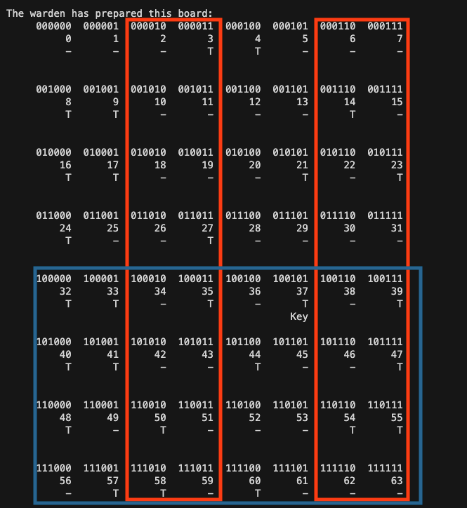

# Almost Impossible Chessboard Puzzle (in Go)

## What's the puzzle?

> You and a friend are in prison and (of course) there is warden who likes to torture you with puzzles. This time he's come up with something really special. If you solve this puzzle then he'll set you both free! But the puzzle is really hard.
>
> The warden has prepared a special chessboard for this puzzle. It's a regular 8x8 board but elevated: the tiles are on top of 10cm high boxes. That's because the tiles are actually little covers that be lifted. Underneath each cover is a little hollow space. You can think of this as 64 little containers, each covered with a lid and arranged in an 8x8 matrix.
>
> The warden will let you into a room the chessboard. He'll then place a key into one of the containers, underneath one of the tiles of the board. He gets to choose which one and you get to see which tile he chooses. After that he'll distribute coins on top of the chessboard; either heads up or tails up. The warden gets to choose which side is up. Maybe he has a pattern that he follows, or maybe he randomizes which side is up. It's up to him to do decide.
>
> So, at this point the key is under one of the tiles and you know which one. The tiles are all covered with coins, either heads up or tails up.
>
> The warden now tells you to point at one of the coins. You must do so, or you'll fail the puzzle. The one coin that you point out is then flipped. After that he escorts you out of the room. Once you're gone he invites your friend in. If your friend correctly guesses where the key is, you're both free to go!
>
> As a preparation, you and your friend have all the time you need to come up with a strategy to beat the warden. Your strategy may be arbitrarily complex and if that's the case then you may write down instructions so you don't get confused during the actual test. But be aware that the warden hears whatever you discuss, sees your written instructions (if these exist), and he'll do his best to defeat your plans. After all, he gets to choose the location of the key and the orientation of all coins.

*The above text is my description of the problem. There may be other textual representations, but since you're here then you probably already know of the puzzle anyway.*

Here are some relevant links where you can find out more about the puzzle:
- The puzzle description, by Matt Parker: https://www.youtube.com/watch?v=as7Gkm7Y7h4
- 3Blue1Brown's explanation: https://www.youtube.com/watch?v=wTJI_WuZSwE, involving hypercubes and corner coloring
- The solution explained by Kjell-Olov Högdahl: https://www.youtube.com/watch?v=ZtfhkH9H0V8 - a thorough description of the encoding and decoding of a board state into a checksum

## What's the output?

The output of this simulation is pretty bare and just shows the state while solving puzzles. There is no animation or explanation why this works.

Here's how the program shows the board.

```text
The warden has prepared this board:
     000000  000001  000010  000011  000100  000101  000110  000111
          0       1       2       3       4       5       6       7
          -       -       -       T       T       -       -       -


     001000  001001  001010  001011  001100  001101  001110  001111
          8       9      10      11      12      13      14      15
          T       T       -       -       -       -       T       -


     010000  010001  010010  010011  010100  010101  010110  010111
         16      17      18      19      20      21      22      23
          T       T       -       -       -       T       -       T


     011000  011001  011010  011011  011100  011101  011110  011111
         24      25      26      27      28      29      30      31
          T       -       -       T       -       -       -       -


     100000  100001  100010  100011  100100  100101  100110  100111
         32      33      34      35      36      37      38      39
          T       T       -       T       -       T       -       T
                                                Key

     101000  101001  101010  101011  101100  101101  101110  101111
         40      41      42      43      44      45      46      47
          T       T       -       -       T       -       -       T


     110000  110001  110010  110011  110100  110101  110110  110111
         48      49      50      51      52      53      54      55
          T       -       T       -       -       -       T       T


     111000  111001  111010  111011  111100  111101  111110  111111
         56      57      58      59      60      61      62      63
          -       T       T       -       T       -       -       -
```

You've got your 8x8 tiles and each tile shows its overall position (0..63), but also as a string of bits (`000000`..`111111`). The value of the coin on top of the tile is shown as `T` for tails and `-` for heads. The tile under which the key is hidden is indicated by `Key`. I chose to encode a board state into a checksum by summing the tile numbers under a tail (or `T` for true?) while ignoring heads. (The other way around would of course work just as well.)

Next are the actions of the two players, who are called (of course, typically) Alice and Bob. Alice witnesses where the warden has hidden the key, computes a checksum, and thereby derives what coin to flip.

```text
Alice computes the checksum : 010110
The key is at position      : 100101 (abs:37)
The difference              : 110011
Alice asks the difference-coin (abs:51) to be flipped and leaves the room.
```

Computing the checksum can be done in a number of ways. By hand you could just count the number of tails on all tiles that contribute to the rightmost bit of the checksum (these are the columns starting at tile positions 1, 3, 5, and 7). If that's an odd number then the rightmost bit should be a 1, and if that's an even number then the rightmost bit should be a 0. Next you'd count all tails on the tiles that contribute to the one-but-rightmost bit of the checksum (these are the columns starting at tile positions 2, 3, 6 and 7) and so on. The nice thing of this approach is that it shows how one tile can count for different bit positions. **This is in fact is the trick: there are so many combinations of tiles-to-bits mappings that there will always be one single coin to flip in order to get from any checksum to any other.**

This is further shown in the below diagram. Assume that you need to flip the second bit from the right and the leftmost bit (and maybe other bits as well). The second bit from the right occurs in four columns where the topmost tiles are 2, 3, 6 or 7. The leftmost bit occurs in all tiles on the lower half of the board, which are all rows that have as their leftmost tile 32, 40, 48 or 56:



So there are 8 positions where you can flip a coin to change the leftmost bit and the second-to-rightmost bit in the checksum: these are the positions 34, 35, 38, 39, 42, 43, 46, 47, and so on. You can choose to change just these two bits (position 34) or you can change other bits too at the same time - it's up to you. But there are 8 positions to choose from, and they cover all possibilities to change or not change the other 4 bits at the same time.

Incidentally, there is always a coin that you can flip, even if you wouldn't need to flip any. That is the coin on top of tile zero: whether that's heads-up or tails-up doesn't matter. It will never contribute to the board checksum. That's the safeguard that ensures that you can always meet the challenge: *"The warden now tells you to point at one of the coins. You must do so, or you'll fail the puzzle. The one coin that you point out is then flipped."*

The programmatic way to compute the checksum is simply by XOR-ing. The simulation iterates over all tiles, and if the coin on top is tails-up, then it XORs the tile number into the checksum. Given the above board layout the first 3 steps are:

```text
000011  (first tile with a tails-up coin is #3)
000100  (second tile with a tails-up is coin is #4)
------ XOR
000111

000111  (checksum so far)
001000  (next tile with a tails-up coin is #8)
------ XOR
001111

001111  (checksum so far)
001001  (next tile with a tails-up coin is #9)
------ XOR
000110
```

So what Alice does, is compute the checksum (in our case `010110`) and then compute the difference with the key position (`100101`). This is again a XOR operation, or you could just subtract bits without carrying (or add bits without carrying, since we're counting binary):

```text
010110  (checksum)
100101  (key position)
------ XOR
110011  (difference)
```

The beauty of the puzzle is that all Alice has to do, is to ask the warden to flip the coin at the difference-tile `110011`. Et voila - *this magically changes the board checksum to the key position*. Once a coin is flipped, the changed board is shown (there is one difference: one tile will have a a coin value `T` instead of `-` or vv.). Alice leaves the room and Bob comes in. All Bob has to do is to compute the board state checksum, which now points to the key position.

```text
Bob enters the room and sees the modified board (though not where the key is):
     000000  000001  000010  000011  000100  000101  000110  000111
          0       1       2       3       4       5       6       7
          -       -       -       T       T       -       -       -


     001000  001001  001010  001011  001100  001101  001110  001111
          8       9      10      11      12      13      14      15
          T       T       -       -       -       -       T       -


     010000  010001  010010  010011  010100  010101  010110  010111
         16      17      18      19      20      21      22      23
          T       T       -       -       -       T       -       T


     011000  011001  011010  011011  011100  011101  011110  011111
         24      25      26      27      28      29      30      31
          T       -       -       T       -       -       -       -


     100000  100001  100010  100011  100100  100101  100110  100111
         32      33      34      35      36      37      38      39
          T       T       -       T       -       T       -       T
                                                Key

     101000  101001  101010  101011  101100  101101  101110  101111
         40      41      42      43      44      45      46      47
          T       T       -       -       T       -       -       T


     110000  110001  110010  110011  110100  110101  110110  110111
         48      49      50      51      52      53      54      55
          T       -       T       T       -       -       T       T


     111000  111001  111010  111011  111100  111101  111110  111111
         56      57      58      59      60      61      62      63
          -       T       T       -       T       -       -       -


Bob computes the checksum: 100101 (abs:37)
That's the tile Bob wants to get uncovered. Whee! Found the key!
```


## What's this source?

- `main.go`: Simulates one run of the puzzle for an 8x8 chess board, while displaying all output. Next, it runs 1.000.000 more puzzles but in silent mode and checks that the programmed solution works.
  - Change the constant `boardSize` if you want to try another size of the chess board. Note though that the solution only works for 2, 4, 8, 16, 32 etc., so powers of 2.
  - Change the constant `nRuns` if you want more (or less) silent runs to empirically verify that the solution is okay.
- `board/board.go`: Support functions for the board, like `New()` for construction, `String()` for display purposes.
  - Note that the board setup is always random (see `board.Randomize()`). This simulation has no concept of a malevolent warden, just a warden that makes totally random choices. Which, I guess, is okay if you repeat the simulation a lot of times.
  - The functions you need as first prisoner to be introduced to the puzzle:
    - `board.Checksum()` to compute a parity-based checksum over all tiles that have a tails-up coin
    - `board.KeyPosition()` which is the tile under which the warden has placed the key
    - `board.Flip(p int)` using which you ask the warden to flip one of the coins.
  - The functions that your friend needs as second prisoner:
    - `board.Checksum()` to compute the checksum again, now that a coin is flipped.

These aren't the best Go sources that I wrote. There are no tests, and the simulation is not optimized for speed. Because that was not the purpose - I just wanted to see the algorithm at work. If you have improvements (maybe colored output, maybe animations) then feel free to contact me.
